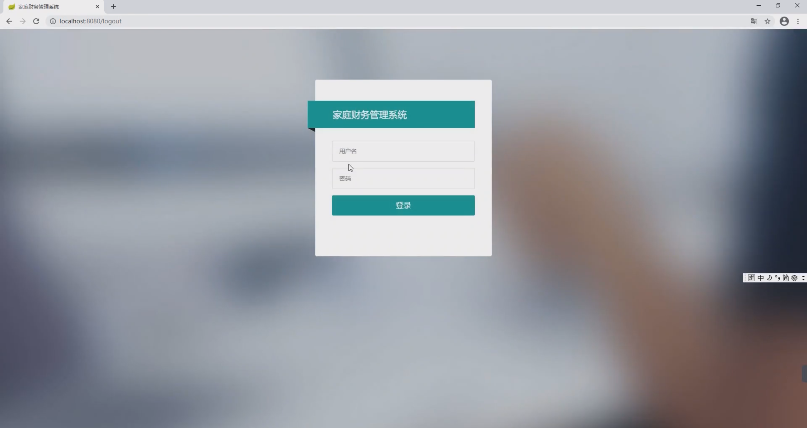
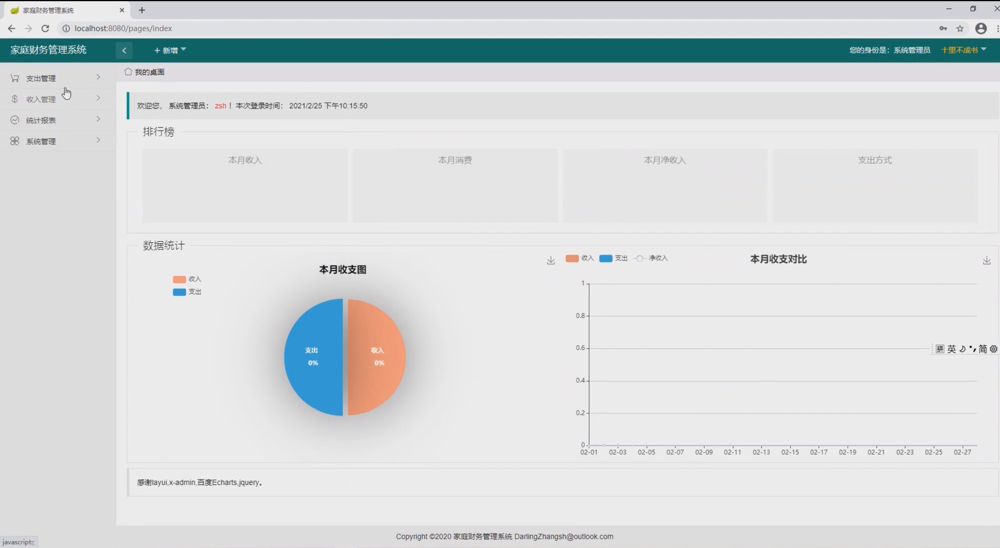
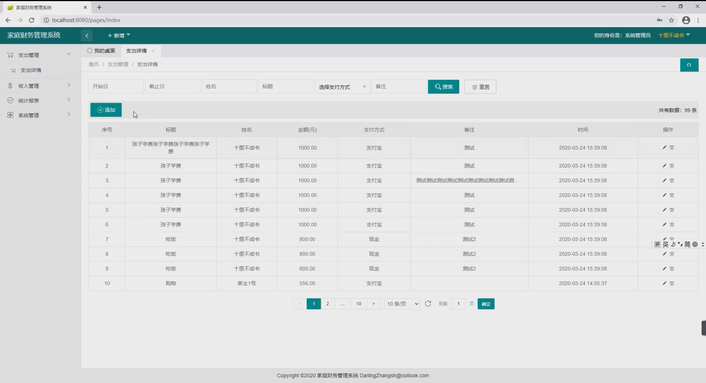
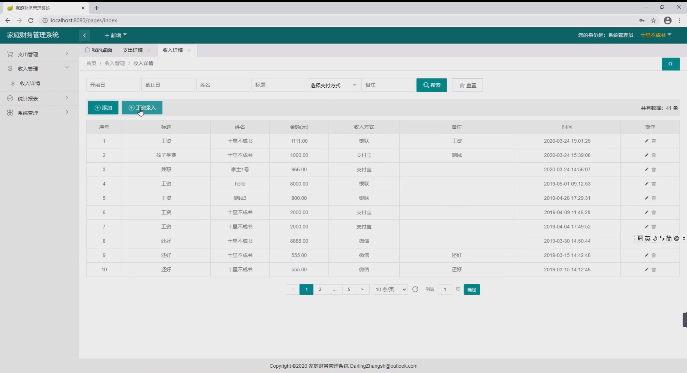
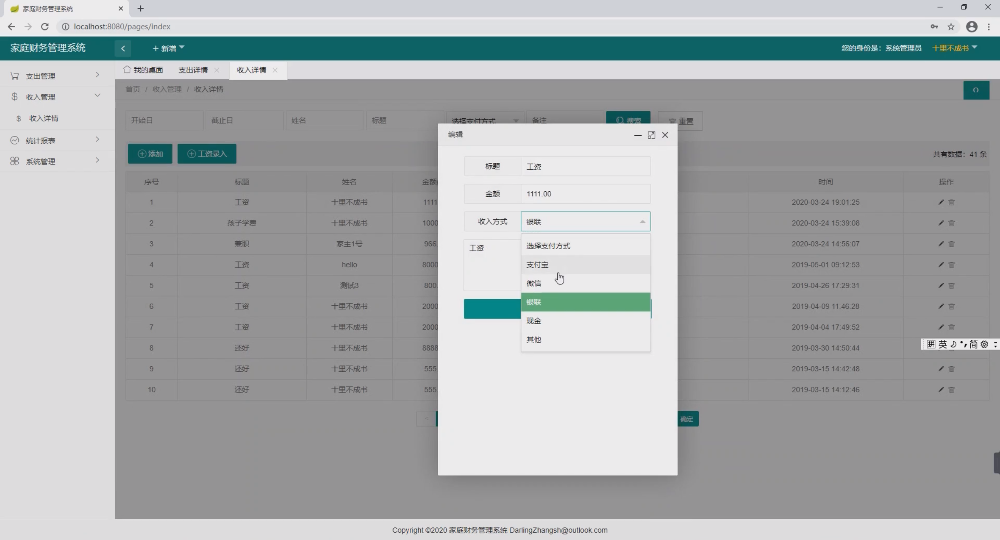
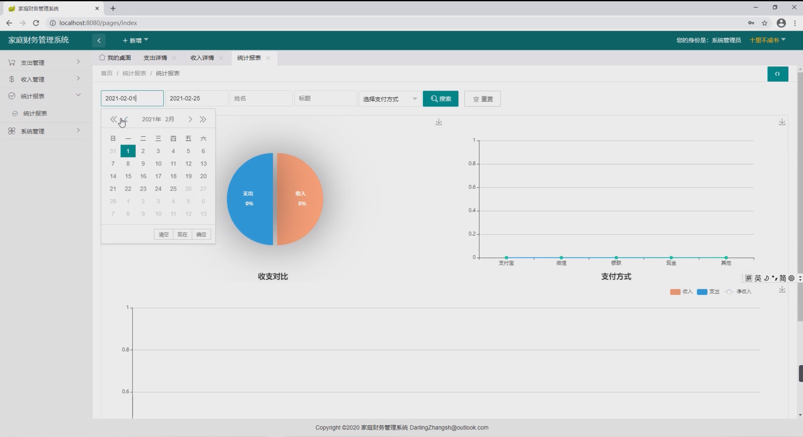
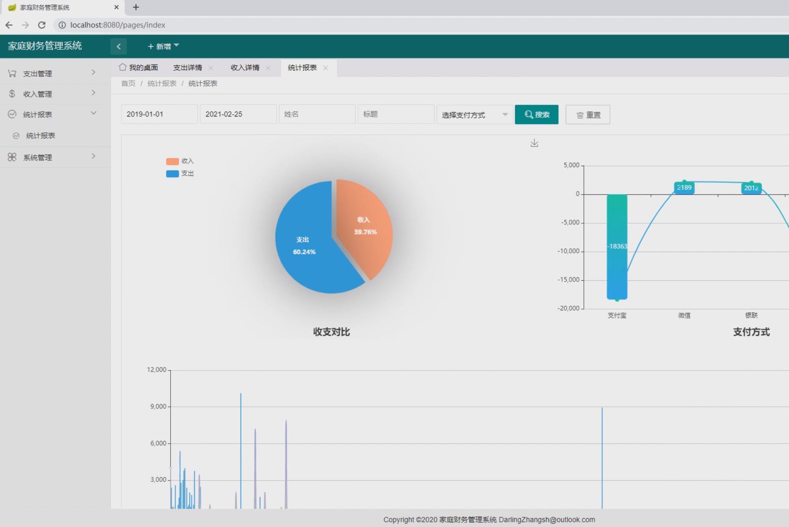
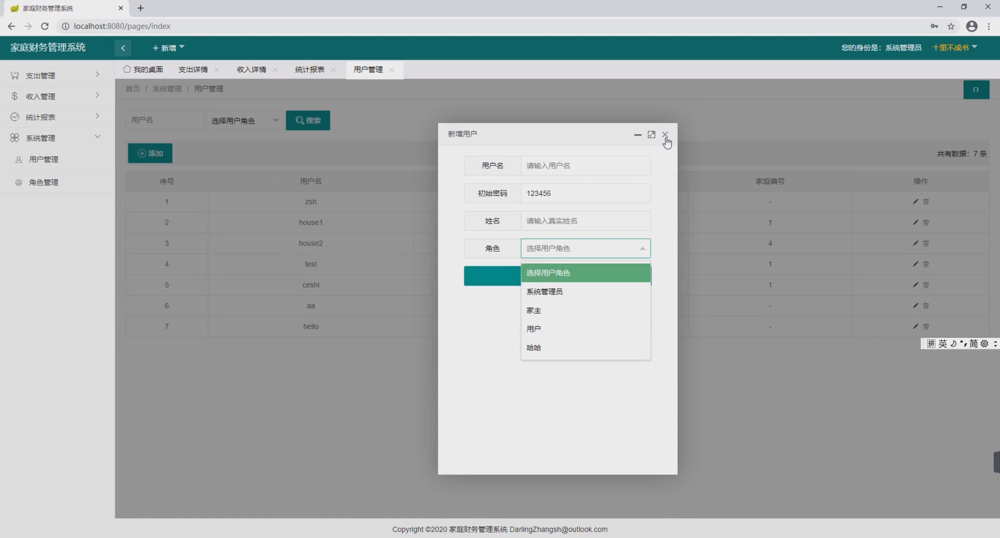

基于Springboot框架实现的家庭财务管理系统
=
###  完整代码获取地址：从戎源码网 ([https://armycodes.com/](https://armycodes.com/))
###  作者微信：19941326836  QQ：952045282 
###  承接计算机毕业设计、Java毕业设计、Python毕业设计、深度学习、机器学习
###  选题+开题报告+任务书+程序定制+安装调试+论文+答辩ppt 一条龙服务
###  毕业设计所有选题地址:(https://github.com/3212618475/allProject)

一、项目介绍
---
基于Spring Boot框架实现的家庭财务管理系统，系统包含两种角色：管理员、用户,系统分为前台和后台两大模块，主要功能如下。
### 功能：
家庭财务管理系统，具有收入统计，支出统计，汇总报表，工资录入，其他收入等录入开支信息，echat图标插件引入展示，分页查询，角色管理，用户管理，权限管理
等功能

二、项目技术
---
编程语言：Java
数据库：MySQL
项目管理工具：Maven
前端技术：Vue
后端技术：SpringBoot

三、运行环境
---
操作系统：Windows、macOS都可以
JDK版本：JDK1.8以上都可以
开发工具：IDEA、Ecplise、Myecplise都可以
数据库: MySQL5.7以上都可以
Tomcat：任意版本都可以
Maven：任意版本都可以

四、项目截图
---
文档截图

使用截图

